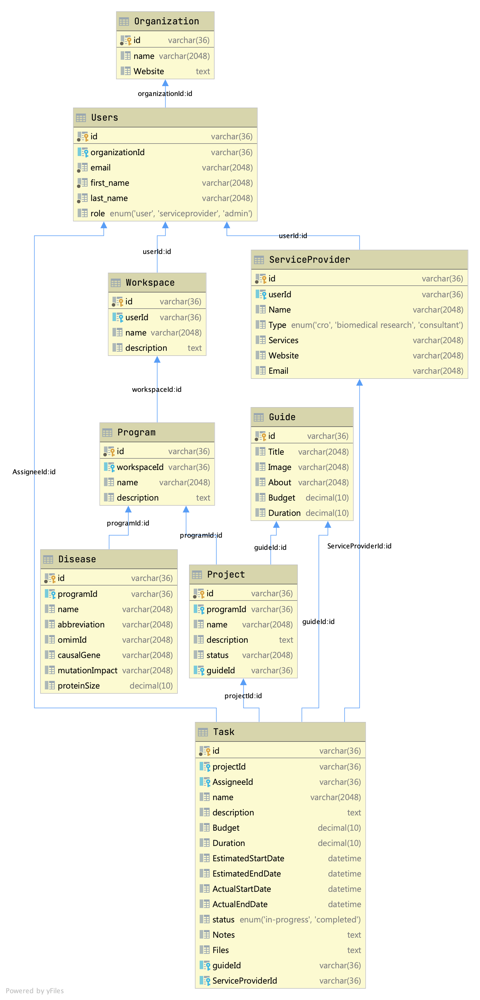

# Data Models Dictionary

This document presents the data model used in this software. It describes different domain entities, fields within
them, and relationships among the entities. Reading this document should provide a good overview of how the
product should work under-the-hood.

Before you proceed, please read [terminologies.md](../terminologies.md) document to familiarize yourself with the
terms.

## Entities

This section describes the entities and fields within each of them.

### User (aka Account)

The person who uses the product and signed up for an account. The User entity also contains credentials for the account
they created within the product.

- **First Name**
- **Last Name**
- **Email**
- **Password**
- **Organization**: Which organization is this person affiliated with?
- **Workspaces**: Workspaces owned by this user. Currently, we only support one workspace for a user

### Organization

A non-profit organization, company, university or any institution the user is affiliated with.
There is a special organization called _**individual**_ used to represent users who are not affiliated with any
organization.

- **Id**:
- **Name**
- **Website**
- **Disease**

### Disease

Information about the disease represented by the organization or the user

- **Id**:
- **Name**: Name of this disease
- **Abbreviation**: Short form abbreviation of disease name for ease of display
- **OMIM ID**: OMIM is an online database that assigns an ID for diseases. Ex: https://omim.org/entry/250220
- **Causal Gene**: Name of the gene that causes the disease
- **Mutation Impact**: Explains what happens when there is a mutation in this gene.
  This helps determine whether this disease will be a good fit for gene therapy
- **Size of Protein**: How many amino acids are there in this protein? Determines our strategy
  to build a gene therapy for this disease
- **Organizations**: Organizations currently working on this disease

### Workspace

Workspace is a logical grouping of Programs within the product.

- **Id**:
- **user**: owner of the workspace
- **Name**: (unused)
- **Description**: (to be added)
- **Programs**: List of programs within this workspace

### Program

A program represents a track of work to create a treatment

- **Id**:
- **Name**
- **Description**
- **Projects**: Collection of projects that are a part of the program

### Project

A Project represents an activity necessary to advance the Program forward. A Project is a collection of Tasks

- **Id**:
- **Name**
- **Description**
- **Status**: Is this project active, or deleted or archived?
- **Tasks**: Collection of Tasks that are a part of the project
- **Education**: Education materials to help users understand the purpose of the Project and guide them to make a decision

### Task

A Task is the smallest unit of work from a planning point-of-view.

- **Id**:
- **Name**
- **Description**
- **Status**: What is the status of this task? In-Progress, Completed etc
- **Asignee**: Who is responsible for completing the task?
- **Budget**: Expected Cost of completing this task
- **Duration**: Expected time to complete this task
- **EstimatedStartDate**: When do we expect to start the task?
- **EstimatedEndDate**: When do we expect to complete the task?
- **ActualStartDate**: Stores the date when the task was actually started
- **ActualEndDate**: After the task was completed, this field stores the date when the task actually completed?
- **Notes**: Notes collected and written by the users as they are working on the task
- **Files**: Files and documents uploaded by the user to this task
- **Guide**: Education materials to help users make decisions and execute this task
- **ServiceProviders**: List of Service providers capable of executing this task

### ServiceProvider

A ServiceProvider is a person or institution providing service to advance the treatment development Program

- **Id**:
- **Name**
- **Type**: What type of service provider is this entity? CRO, Biomedical research, Consultant etc.
- **Services**: Description of types of services provided
- **Website**
- **Email**
- **User**: If the service provider has an account on the product, then link to the specific User entity

### Guide

Education materials to guide users to make decisions and help them execute a project or a task.

- **Id**:
- **Title**: Name of the activity representing education material
- **Image**: Image providing helpful information about this activity
- **About**: About this activity
- **Budget**: Expected cost of the activity
- **Duration**: Expected duration for the activity

### Files

Files uploaded by users on the platform.

- **Id**: Internal unique identifier for each file
- **OriginalName**: The original name of the file when user uploaded it. Our system could change the name in future for internal storage purposes. We are using this to track the original file name to help users remember the file.
- **Description**
- **Location**: Internal location where the file is stored and can be retrieved from
- **User**: The user that uploaded the file

### ProjectLibrary

Collection of pre-built projects and tasks for users to chose from. When a new Program is created, we present users
with a collection of Projects/Tasks copied from this library to help them get started quickly. When the user creates
a new Project, they can optionally select one from this library. The projects and tasks have guidance education material
associated with them.

- **Id**:
- **Projects**: List of pre-built projects

### Role

Defines the permissions a particular user has within the product. A user can be affiliated with multiple Programs in different capacities like creator/collaborator, etc. This information will be captured in Roles

TBD

## Data model diagram

**Note**: The following diagram represents the data model entities hierarchy and relationships to which the system implementation should adhere, and it does not refer to any database schema or normalization.

