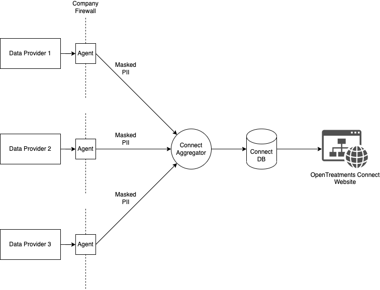

# Connect: Counting Diagnosis of Rare Diseases

As a part of OpenTreatments Connect project, we will be aggregating and displaying the number of patients diagnosed with rare genetic diseases on a publicly accessible dashboard. In this document, we propose a technical architecture to perform the aggregation and counting.

## Terminologies
* *Patient*: Anyone with a rare genetic disease, diagnosed or not.
* *Genetic Diseases*: Diseases caused by variations in a person's gene or chromosome
* *Data Provider*: Entites that can provide data about patients diagnosed with rare genetic diseases. This includes genetic testing companies, registry platforms, natural history platforms, clinicians, hospitals, researchers etc.
* *PII (Personally Identifiable Information)*: Any information that can uniquely identify a patient (name, date of birth, address) etc. 
* *Prevalance*: Ideal number of patients living with a given disease. This can never be accurately determined and is always an estimate.
* *Diagnosis count*: Number of patients who have a confirmed diagnosis of a given disease. This is calculated based on the data we have in various data providers.

## High Level Architecture
Objective of this project is to calculate diagnosis counts of rare genetic diseases and display in a publicly accessible dashboard. We will acquire a PII about diagnosed patients from Data Providers, de-deduplicate the individuals, and compute the actual diagnosis count per disease. Since the exchange of PII will compromise patient's privacy (HIPAA, GDPR etc), we will utilize a method called [Privacy Preserving Record Linkage (PPRL)](https://link.springer.com/chapter/10.1007/978-3-319-49340-4_25) to mask the PII values sent by the Data Providers. PPRL algorithms enable us to perform de-duplication on the masked values to prevent double counting the same individual.

The following diagram provides a high-level schematic of the architecture: 

There are four components:
* **Agent**: This is a piece of software that runs inside the firewall of the Data Provider company. The Agent connects with the Data Provider's internal database, pulls information about diagnosed patients, performs the masking, and exchanges masked PII with the Aggregator.

* **Aggregator**: The Aggregator component receives data from all the agents, performs de-duplication, and calculates the count of diagnosed patients on disease-by0disease basis. 

* **Connect DB**: The aggregator dumps the counts into a database on a periodic basis. This could be hourly, nightly, or some other frequency that made sense.

* **Connect Website**: The publicly visible webpage pulls the data from Connect DB and displays them in a publicly visible dashboard.

## Challenges
The high level architecture looks quite simple in theroy, but has a fair bit of complexity underneath. The challenges fall in the following categories:

### PPRL Challenges

* *Will PPRL scale?*: The concept of Privacy Preserving Record Linkage is well understood but they are meant to operate on two data providers, not the 100+ number of data providers Connect will work with. 
* *Mathematically advanced*: There are many PPRL algorithms but all of them require access to advanced mathematical libraries to execute (ex: Bloom Filters). Even if we find existing libraries, validating the implementation requires mathematical expertise. 
* *Debugging is hard*: Since only the masked values are exchanged, it is hard to to manually inspect and debug any failures to de-duplicate. We might have to build custom tooling and infrastructure to debug such situations.

### Distributed Agents Challenges

TBD

### Data Fields sent by data providers

**Quasi IDs**

* First Name
* Last Name
* Date of Birth
* City of Birth

**Additional data**
* Diagnosis (OrphanetID or OMIM ID) (some people might have multiple rare diseases**)
* Data Source ID
* Linkback ID (Psedonymized or not - TBD?)
* Month and Year of Diagnosis (not always available, if they don't do genetic testing)
* Type of variant: Enum of values - Pathogenic, Likely Pathogenic, Variant of Uncertain Significance
* 

